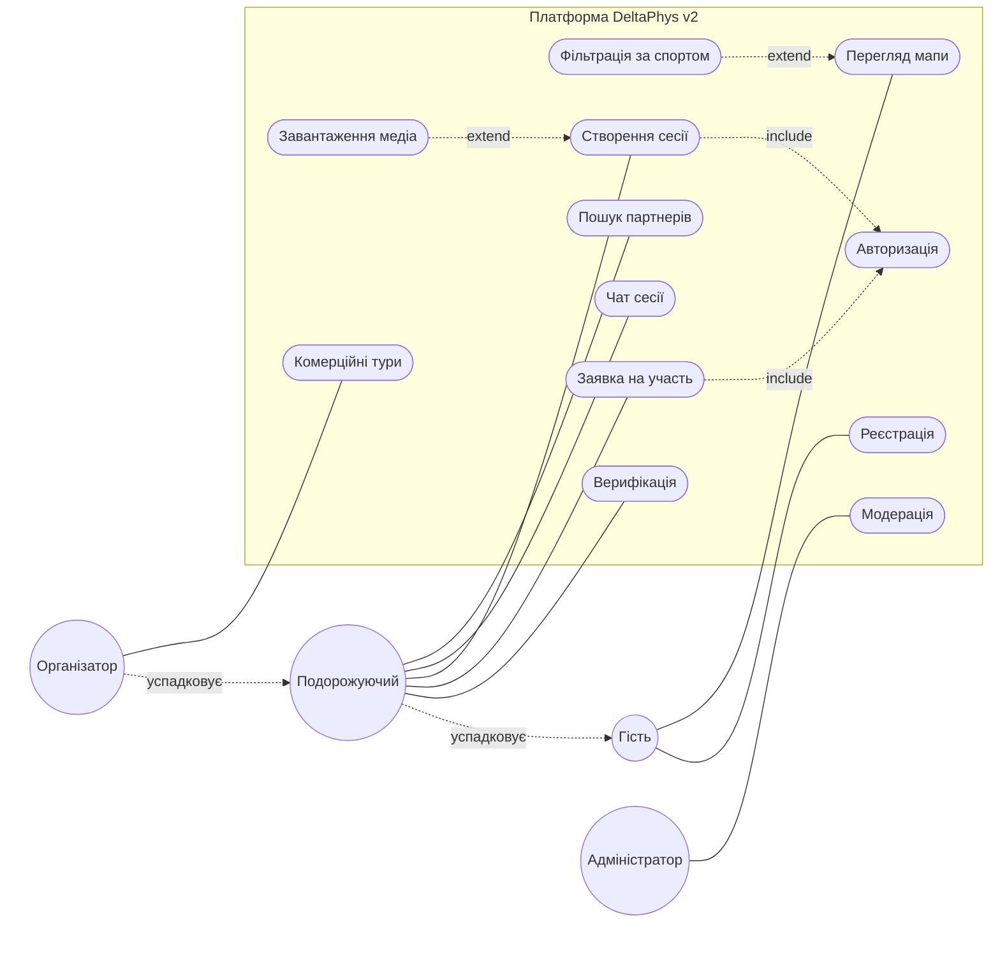
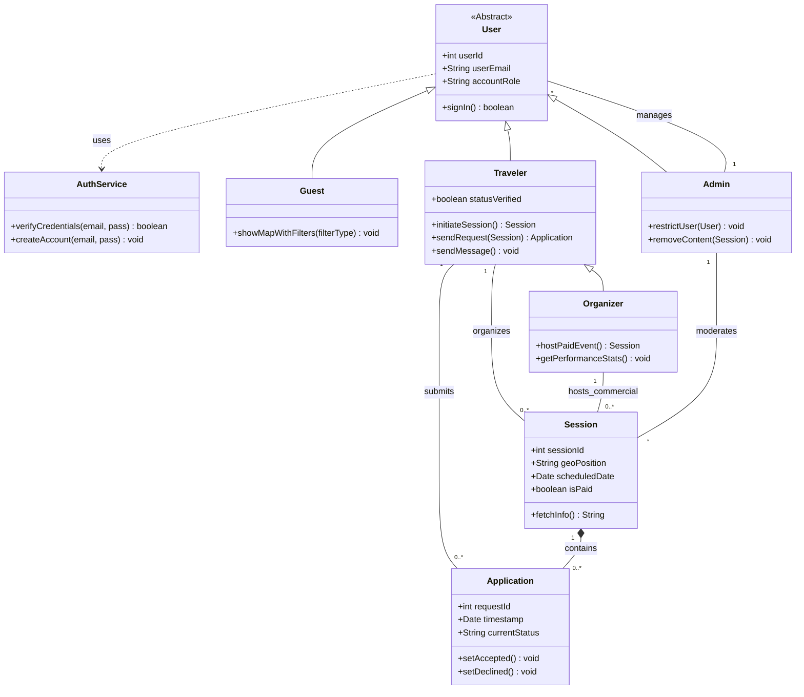
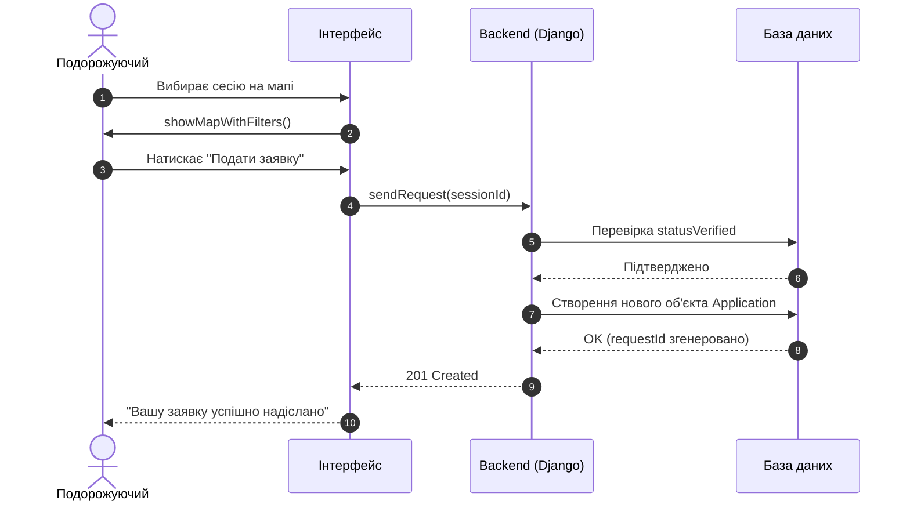

# Лабораторна робота №2: Моделювання ПС засобами UML
**Виконав:** Гладких А.Р.  
**Група:** ПЗПІ-25-3  
**Проєкт:** DeltaPhys — платформа для спортивного нетворкінгу.

---

## 1. Функціональні вимоги (FR)
* **FR-01:** Модуль автентифікації повинен забезпечувати реєстрацію нових користувачів через електронну пошту.
* **FR-02:** Функціонал системи має дозволяти формування пошукових запитів у вигляді анкет-сесій для нетворкінгу.
* **FR-03:** Система повинна генерувати публічний шар карти з геомітками запланованих спортивних подій.
* **FR-04:** Програмне забезпечення має надавати статус «верифіковано» користувачам після перевірки їхніх даних.
* **FR-05:** У системі має бути реалізована можливість обміну текстовими повідомленнями між учасниками конкретного виїзду.
* **FR-06:** Система повинна дозволяти фільтрацію подій за видом спорту.

---

## 2. Діаграми (Код Mermaid)

### 2.1. Діаграма прецедентів (Use Case Diagram)

### 2.2. Діаграма класів (Class Diagram)

### 2.3. Діаграма послідовності (Sequence Diagram)

### 3. Матриця трасовності

Вимога                | Use Case             |  Класи,                       | Sequence
:---                  | :---                 | :---                          | :--- 
FR-01: Реєстрація     | UC2: Реєстрація      |  "AuthService, User"          | -----
FR-02: Пошукові запити| UC5: Створення сесії |  "Traveler, Session"          | -----
FR-03: Публічна карта | UC1: Перегляд мапи   |  "Guest, Session"             | -----
FR-04: Верифікація    | UC7: Верифікація     |  Traveler (statusVerified)    | Перевірка statusVerified
FR-05: Чат            | UC4: Чат сесії       |  Traveler (sendMessage)       | -----
FR-06: Фільтрація     | UC11: Фільтрація     |  Guest (showMapWithFilters)   | showMapWithFilters()